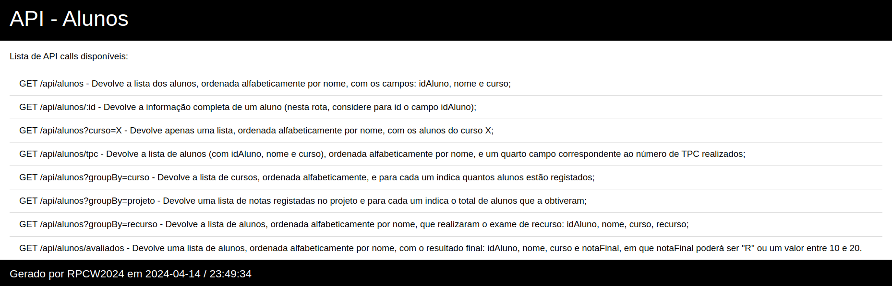

# TP7  - Aferição
__Data:__ 10/4/2024

__Autor:__ Robert Szabo

__UC:__ RPCW

---

## Ontologia 
Inicialmente foi necessário criar uma ontologia no Protegé, com as classes e propriedades necessárias. As classes geradas foram: 
- Aluno; 
- TPC;
- Exame.

As data properties geradas foram:
- id_aluno;
- nome;
- curso;
- nota_projeto;
- nota.

As object properties geradas foram:
- temTPC;
- temExame

Com isto foi possível gerar um ficheiro .ttl com os dados dos alunos, TPCs e Exames.
De seguida, foi criada uma script em Python que lê informação de um ficheiro .json e adiciona os dados à ontologia criada anteriormente.
Assim, a ontologia encontra-se pronta para ser carregada num repositório no GraphDB, onde se poderá fazer uma exploração mais detalhada dos dados.

---

## Queries
Foram realizadas algumas queries para explorar os dados da ontologia.

### Quantos alunos estão registados? (inteiro)
```sql
PREFIX a: <http://rpcw.di.uminho.pt/2024/avaliacao/>
PREFIX rdf: <http://www.w3.org/1999/02/22-rdf-syntax-ns#>
select ?s where {
    ?s rdf:type a:Aluno .
}
```

306 alunos

### Quantos alunos frequentam o curso "LCC"? (inteiro)
```sql
PREFIX a: <http://rpcw.di.uminho.pt/2024/avaliacao/>
PREFIX rdf: <http://www.w3.org/1999/02/22-rdf-syntax-ns#>
select ?s where {
    ?s rdf:type a:Aluno ;
       a:curso "LCC" .
}
```

44 alunos

### Que alunos tiveram nota positiva no exame de época normal? (lista ordenada alfabeticamente por nome com: idAluno, nome, curso, nota do exame);
```sql
PREFIX a: <http://rpcw.di.uminho.pt/2024/avaliacao/>
PREFIX rdf: <http://www.w3.org/1999/02/22-rdf-syntax-ns#>
select ?id ?nome ?curso ?nota_proj where {
    ?s rdf:type a:Aluno ;
       a:id_aluno ?id ;
       a:nome ?nome ;
       a:curso ?curso ;
       a:nota_projeto ?nota_proj .
    
    FILTER(?nota_proj > 10)
}

ORDER BY ?nome
```

### Qual a distribuição dos alunos pelas notas do projeto? (lista com: nota e número de alunos que obtiveram essa nota)
```sql
PREFIX a: <http://rpcw.di.uminho.pt/2024/avaliacao/>
PREFIX rdf: <http://www.w3.org/1999/02/22-rdf-syntax-ns#>
select ?nota_proj (COUNT(DISTINCT ?s) as ?num_alunos) where {
    ?s rdf:type a:Aluno ;
       a:nota_projeto ?nota_proj .
}

GROUP BY ?nota_proj
ORDER BY ASC (?nota_proj)
```

### Quais os alunos mais trabalhadores durante o semestre? (lista ordenada por ordem ecrescente do total: idAluno, nome, curso, total = somatório dos resultados dos TPC)
```sql
PREFIX a: <http://rpcw.di.uminho.pt/2024/avaliacao/>
PREFIX rdf: <http://www.w3.org/1999/02/22-rdf-syntax-ns#>

select ?id ?nome ?curso (SUM(?notas_tpc) as ?total) where {
    ?s rdf:type a:Aluno ;
       a:id_aluno ?id ;
       a:nome ?nome ;
       a:curso ?curso ;
       a:temTPC ?tpc .
    
    ?tpc a:nota ?notas_tpc .
}

GROUP BY ?id ?nome ?curso
ORDER BY DESC (?total)
```

### Qual a distribuição dos alunos pelos vários cursos? (lista de cursos, ordenada alfabeticamente por curso, com: curso, número de alunos nesse curso)
```sql
PREFIX a: <http://rpcw.di.uminho.pt/2024/avaliacao/>
PREFIX rdf: <http://www.w3.org/1999/02/22-rdf-syntax-ns#>
select ?curso (COUNT(?s) as ?total) where {
    ?s rdf:type a:Aluno ;
       a:id_aluno ?id ;
       a:nome ?nome ;
       a:curso ?curso ;
       a:temTPC ?tpc .
}

GROUP BY ?curso
ORDER BY DESC (?total)
```

## API REST em Flask
Foi criada uma API REST em Flask que permite a consulta de dados da ontologia através de queries SPARQL. A API permite a execução de queries SPARQL e a visualização dos resultados em formato JSON.

### Endpoints


