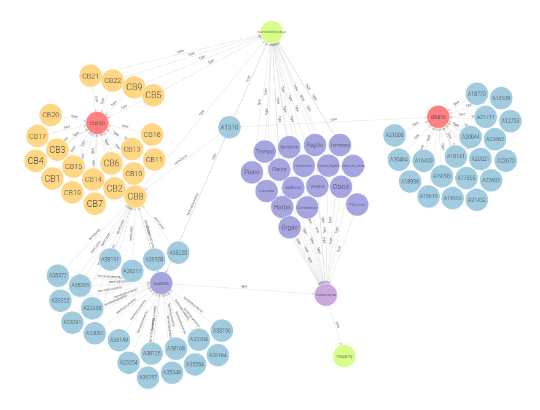

# Dataset Escola de Música

O propósito deste trabalho é analisar, modelar e representar um conjunto de dados associados a uma Escola de Música. O dataset abrange informações sobre alunos, instrumentos e cursos.

## Estrutura do Ficheiro JSON
O ficheiro JSON tem a seguinte estrutura:

```json
{
    "alunos": [
        {
            "id": "A1510",
            "nome": "ADEMAR FONTES DE MAGALHAES GONCALVES",
            "dataNasc": "1999-4-19",
            "curso": "CB8",
            "anoCurso": "5",
            "instrumento": "Guitarra"
        }
    ],
    "cursos": [
        {
            "id": "CB8",
            "designacao": "Curso Básico de Guitarra",
            "duracao": "5",
            "instrumento": {
                "id": "I8",
                "#text": "Guitarra"
            }
        }
    ],
    "instrumentos": [
        {
            "id": "I8",
            "#text": "Guitarra"
        }
    ]
}
``` 

## Etapas Realizadas

### 1. Análise do Dataset

Uma análise abrangente do conjunto de dados foi conduzida, destacando informações redundantes e identificando inconsistências. Garantindo a preparação adequada dos dados para a subsequente modelagem da ontologia.

### 2. Criação da Ontologia

Foi elaborada uma ontologia para representar de forma estruturada e semântica as entidades presentes no dataset:

- **Classes:** Aluno, Instrumento e Curso.
- **Object Properties:** ensinaInstrumento, temCurso, temInstrumento.
- **Data Properties:** anoCurso, dataNasc, designacao, duracao, idAluno, idCurso, idInstrumento, instrumento, nome.

### 3. Script de Povoamento da Ontologia

De seguida, foi desenvolvido uma script em Python que percorre o dataset e popula a ontologia com os dados extraídos.

### 4. Criação de um Repositório no GraphDB

Finalmente, o ficheiro gerado pela script foi importado no GraphDB podendo observar a seguinte estrutura de dados.


