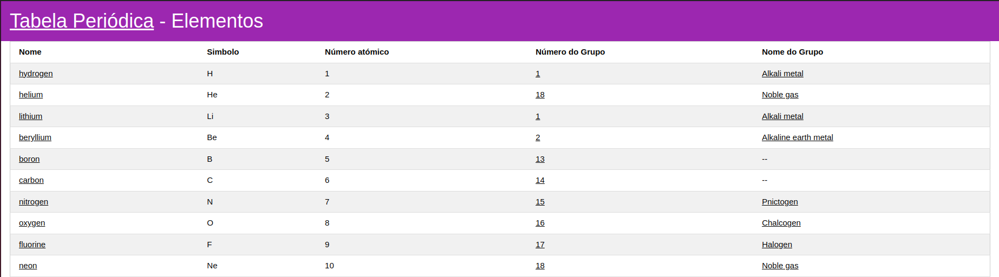
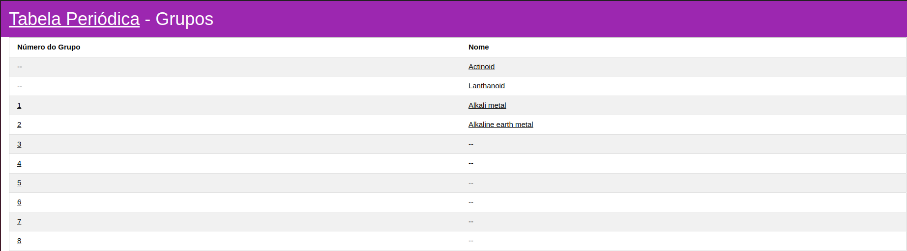
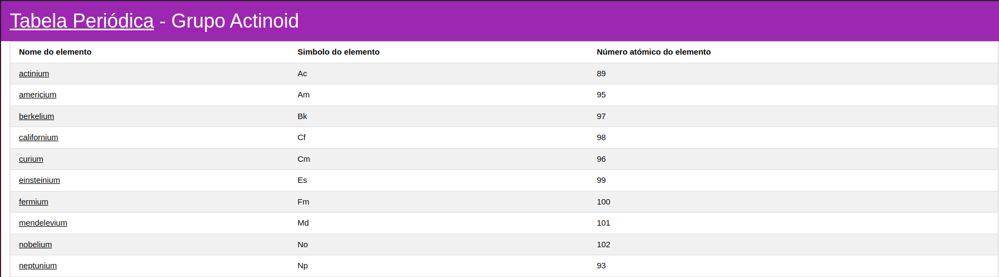
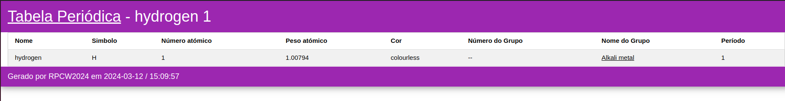

# TP4 - Tabela periódica - Web App
__Data:__ 11/3/2024

__Autor:__ Robert Szabo

__UC:__ RPCW

---

# Tabela Periódica

## Descrição
Aplicação web simples que fornece informações sobre a tabela periódica dos elementos. Permite a pesquisa de elementos específicos e visualização das suas propriedades, como número atômico, símbolo, peso atômico e muito mais. Permite também explorar os diferentes grupos de elementos.

## Processo de desenvolvimento
A tabela periodica foi carregada no GraphDB permitindo a exploração da ontologia e as suas propriedades. Assim foi possível realizar queries SPARQL que permitem obter os dados desejados para a sua apresentação em formato web usando HTML/CSS.

Foram desenvolvidas diferentes páginas como: Elementos, Grupos, Grupo e Elemento, que listam ou especificam um grupo ou elemento desejado.

A navegação pela página é possível a partir de hiperligações.

## Páginas

### Elementos

### Grupos

### Grupo

### Elemento

